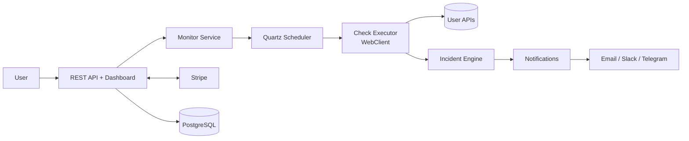
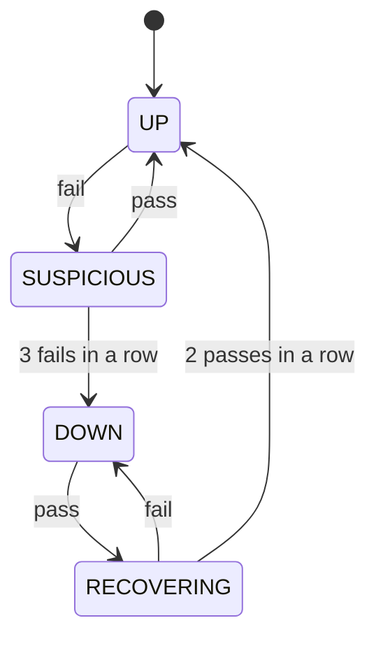

# Architecture Essentials

## PulseGuard — API Monitoring & Incident Platform

*The one-page version of `architecture.md`. Read this first; go to the full doc for details.*

---

## 1. What It Is

One **Spring Boot** application (modular monolith) that polls user APIs on a schedule, opens incidents when they fail, sends alerts, and charges subscriptions through Stripe.

---

## 2. The Big Picture



---

## 3. Stack

| Layer | Choice |
|---|---|
| Language / Framework | Java 21, Spring Boot 3 |
| Database | PostgreSQL + Flyway migrations |
| Scheduling | Quartz (JDBC store, clustered) |
| HTTP checks | Spring WebClient (non-blocking) |
| Security | Spring Security + BCrypt + JWT |
| Email | Spring Mail + Resend / SendGrid |
| Payments | Stripe Checkout + Customer Portal + Webhooks |
| Frontend | Thymeleaf (simple) or React (SPA) |
| Deploy | Docker on Render / Railway / Fly.io |
| Queue | None for MVP (add Redis later) |

---

## 4. The Core Loop

1. **Quartz** fires a job for a monitor at its interval.
2. **Check Executor** calls the URL with a strict timeout and saves the result.
3. **Incident Engine** updates the monitor's state.
4. If the monitor becomes **DOWN**, open an incident; if it recovers, resolve it.
5. **Notification Service** sends alerts *after* the database commit, asynchronously.

---

## 5. Incident State Machine



- **DOWN** = open incident + alert
- **Back to UP** = resolve incident + alert

---

## 6. Core Tables

| Table | Holds |
|---|---|
| `users` | Account, plan, Stripe customer ID |
| `monitors` | URL, interval, timeout, current state, failure counters |
| `checks` | Every check result (status, response time, error) |
| `incidents` | Open/resolved incidents with start/end time |
| `notification_channels` | Where each user wants alerts sent |
| `notifications` | Log of alerts sent (prevents duplicates) |
| `subscriptions` | Stripe subscription status |
| `check_daily_stats` | Daily uptime rollups for fast dashboards |

---

## 7. Five Rules You Must Not Break

1. **Always use timeouts** on checks, so one slow API never blocks the others.
2. **One open incident per monitor**, enforced by a partial unique index in PostgreSQL.
3. **Alert only after commit**, using `@TransactionalEventListener(AFTER_COMMIT)`, so you never alert about an incident that failed to save.
4. **Enforce plan limits on the server**, not only in the UI.
5. **Block internal URLs (SSRF)**, checked after DNS resolution: `localhost`, `10.x`, `172.16–31.x`, `192.168.x`, `169.254.x`.

---

## 8. Package Structure

```
com.pulseguard
├── auth          # login, JWT, users
├── monitor       # monitor CRUD
├── scheduling    # Quartz jobs
├── check         # HTTP checks
├── incident      # state machine
├── notification  # email, Slack, Telegram
├── billing       # Stripe
├── stats         # rollups, retention
└── statuspage    # public status page
```

---

## 9. Build Order

1. Auth + monitor CRUD
2. Check executor (one manual check)
3. Quartz scheduling
4. Incident state machine
5. Email alerts
6. Dashboard
7. Stripe subscriptions
8. Stretch: status page, Slack/Telegram

---

## 10. Scaling Path

- **MVP:** 1 app instance + PostgreSQL → hundreds of monitors
- **Growth:** multiple instances (Quartz clustering) + rollups → thousands
- **Scale:** separate API and worker services + Redis queue → tens of thousands
