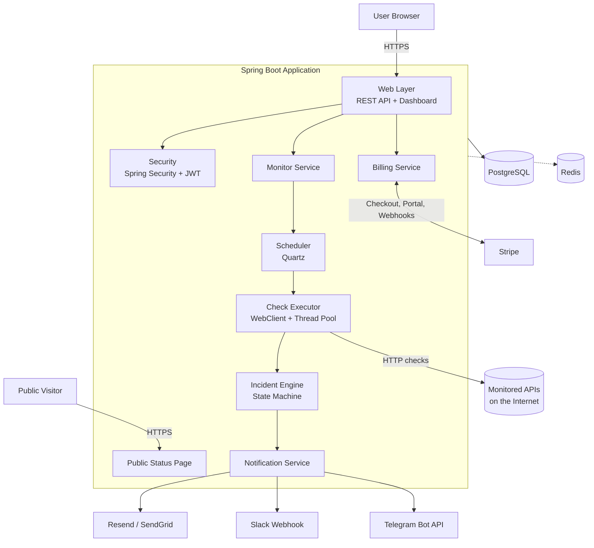
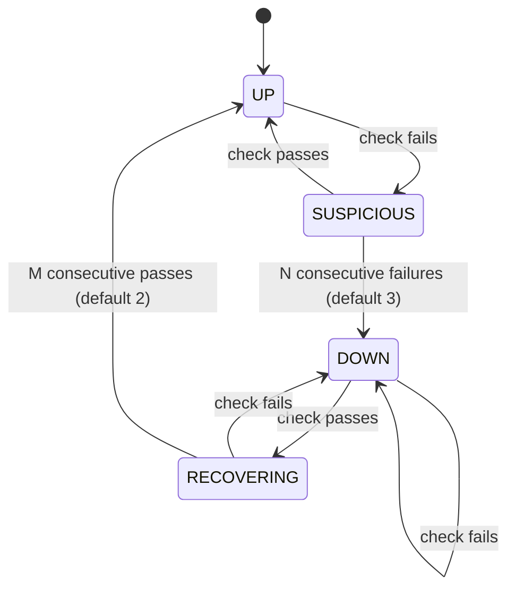
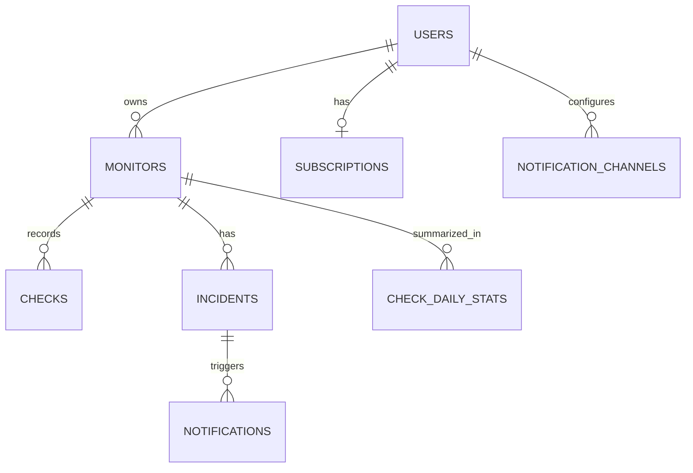
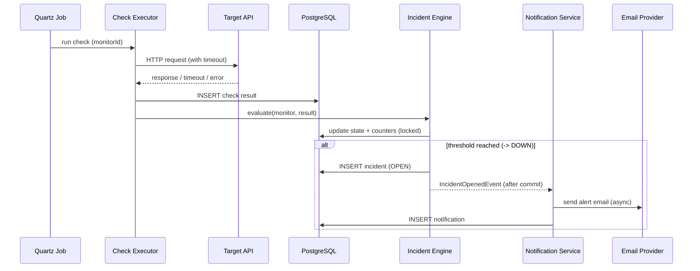
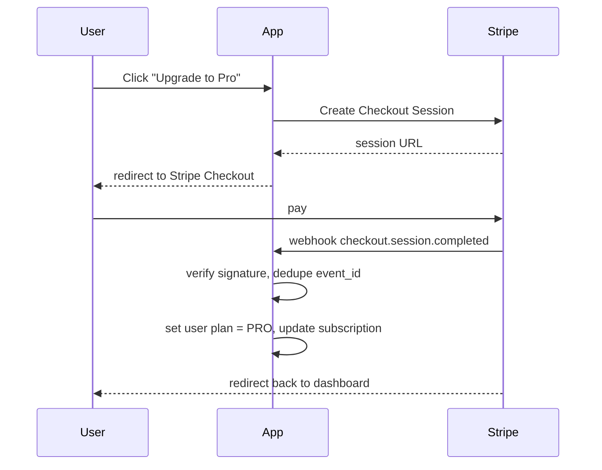
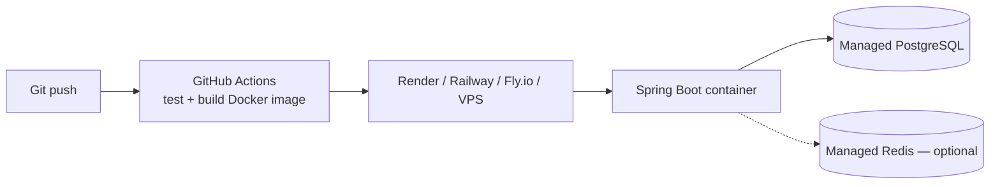

# Architecture Document

## PulseGuard — API Monitoring & Incident Platform

*Companion to `prd.md`. Status: Draft v1.*

---

## 1. Architecture Goals

- **Simple first:** a single deployable Spring Boot application for the MVP (modular monolith), split into services only when scale demands it.
- **Reliable polling:** scheduled checks must survive restarts and never block on slow endpoints.
- **No false alarms:** incident decisions are made by a state machine, not a single check result.
- **Idempotent and safe:** duplicate checks or concurrent workers must never create duplicate incidents or duplicate alerts.
- **Easy to extend:** new alert channels (Slack, Telegram, SMS, webhook) plug in without touching core logic.

---

## 2. High-Level Architecture



---

## 3. Components

### 3.1 Web Layer
- **REST API** (`/api/**`) built with Spring Web — consumed by the dashboard or any client.
- **Dashboard UI** — Thymeleaf pages (simplest) or a separate React SPA calling the REST API.
- **Public Status Page** (`/status/{slug}`) — read-only, no auth, cached.

### 3.2 Security
- Spring Security with JWT (for SPA) or session cookies (for Thymeleaf).
- Passwords hashed with BCrypt.
- Every query is scoped by `user_id` so users can only see their own monitors (tenant isolation).
- Stripe webhook endpoint is excluded from auth but verified by Stripe signature.

### 3.3 Monitor Service
- CRUD for monitors.
- Validates input against the user's plan (monitor count limit, minimum interval).
- On create/update/pause/delete, tells the Scheduler to add, reschedule, or remove the job.

### 3.4 Scheduler (Quartz)
- One Quartz job per active monitor, triggered at the monitor's `interval_seconds`.
- **JDBC job store** in PostgreSQL so schedules survive restarts.
- **Clustered mode** enabled so multiple app instances never run the same job twice.
- Misfire policy: if the app was down, run once on recovery rather than replaying every missed check.

**MVP alternative:** a single `@Scheduled(fixedDelay = 10s)` loop that queries `monitors WHERE next_check_at <= now()` and dispatches them. Simpler, slightly less precise. Either works; Quartz is the more scalable choice.

### 3.5 Check Executor
- Uses **Spring WebClient** (non-blocking) to call the target URL.
- Strict per-monitor timeout (connect + read).
- Bounded thread pool / concurrency limit so thousands of monitors can't exhaust resources.
- Records result: `UP` or `DOWN`, status code, response time, error type (timeout, DNS, SSL, connection refused, unexpected status).
- Saves a row in `checks`, then hands the result to the Incident Engine.

### 3.6 Incident Engine (State Machine)



- Entering `DOWN` → **open incident** + publish `IncidentOpenedEvent`.
- Leaving `RECOVERING` to `UP` → **resolve incident** (set `resolved_at`, duration) + publish `IncidentResolvedEvent`.
- Monitor state and failure counters stored on the `monitors` row.
- Updates use **optimistic locking** (`@Version`) or `SELECT ... FOR UPDATE` so two concurrent checks can't both open an incident.
- A **partial unique index** guarantees at most one open incident per monitor (see section 4).

### 3.7 Notification Service
- Listens for incident events using Spring's `@TransactionalEventListener(phase = AFTER_COMMIT)` — alerts fire only after the incident is safely saved.
- Runs `@Async` so slow email providers never delay checks.
- Strategy pattern for channels:

```java
public interface NotificationChannel {
    ChannelType type();                 // EMAIL, SLACK, TELEGRAM, SMS, WEBHOOK
    void send(AlertMessage message, ChannelConfig config);
}
```

- Every sent alert is logged in `notifications` with a unique key `(incident_id, channel_id, event_type)` to prevent duplicate alerts on retry.
- Failed sends are retried with backoff (Spring Retry).

### 3.8 Billing Service
- Creates Stripe Checkout Sessions for upgrades.
- Redirects to Stripe Customer Portal for manage/cancel.
- Webhook endpoint `/api/stripe/webhook` handles `checkout.session.completed`, `customer.subscription.updated`, `customer.subscription.deleted`, `invoice.payment_failed`.
- Webhook events stored by `stripe_event_id` to process each event only once.
- Exposes a `PlanLimits` lookup used by Monitor Service for feature gating.

### 3.9 Housekeeping Jobs
- **Rollup job (daily):** aggregates raw `checks` into `check_daily_stats` (uptime %, avg/p95 response time).
- **Retention job (daily):** deletes raw checks older than the plan's retention window.

---

## 4. Data Model



```sql
CREATE TABLE users (
    id                  BIGSERIAL PRIMARY KEY,
    email               VARCHAR(255) UNIQUE NOT NULL,
    password_hash       VARCHAR(255) NOT NULL,
    plan                VARCHAR(20)  NOT NULL DEFAULT 'FREE',
    stripe_customer_id  VARCHAR(100),
    created_at          TIMESTAMPTZ  NOT NULL DEFAULT now()
);

CREATE TABLE monitors (
    id                    BIGSERIAL PRIMARY KEY,
    user_id               BIGINT       NOT NULL REFERENCES users(id) ON DELETE CASCADE,
    name                  VARCHAR(100) NOT NULL,
    url                   TEXT         NOT NULL,
    method                VARCHAR(10)  NOT NULL DEFAULT 'GET',
    expected_status       INT          NOT NULL DEFAULT 200,
    interval_seconds      INT          NOT NULL DEFAULT 300,
    timeout_ms            INT          NOT NULL DEFAULT 10000,
    state                 VARCHAR(20)  NOT NULL DEFAULT 'UP',
    consecutive_failures  INT          NOT NULL DEFAULT 0,
    consecutive_successes INT          NOT NULL DEFAULT 0,
    is_active             BOOLEAN      NOT NULL DEFAULT TRUE,
    last_checked_at       TIMESTAMPTZ,
    version               BIGINT       NOT NULL DEFAULT 0,
    created_at            TIMESTAMPTZ  NOT NULL DEFAULT now()
);

CREATE TABLE checks (
    id                BIGSERIAL PRIMARY KEY,
    monitor_id        BIGINT      NOT NULL REFERENCES monitors(id) ON DELETE CASCADE,
    result            VARCHAR(10) NOT NULL,          -- UP / DOWN
    status_code       INT,
    response_time_ms  INT,
    error_type        VARCHAR(30),                   -- TIMEOUT, DNS, SSL, CONNECTION, STATUS_MISMATCH
    error_message     TEXT,
    checked_at        TIMESTAMPTZ NOT NULL DEFAULT now()
);
CREATE INDEX idx_checks_monitor_time ON checks (monitor_id, checked_at DESC);

CREATE TABLE incidents (
    id           BIGSERIAL PRIMARY KEY,
    monitor_id   BIGINT      NOT NULL REFERENCES monitors(id) ON DELETE CASCADE,
    status       VARCHAR(20) NOT NULL DEFAULT 'OPEN',   -- OPEN / RESOLVED
    cause        TEXT,
    started_at   TIMESTAMPTZ NOT NULL DEFAULT now(),
    resolved_at  TIMESTAMPTZ
);
-- At most one open incident per monitor
CREATE UNIQUE INDEX uq_one_open_incident ON incidents (monitor_id) WHERE status = 'OPEN';

CREATE TABLE notification_channels (
    id        BIGSERIAL PRIMARY KEY,
    user_id   BIGINT      NOT NULL REFERENCES users(id) ON DELETE CASCADE,
    type      VARCHAR(20) NOT NULL,       -- EMAIL, SLACK, TELEGRAM, SMS, WEBHOOK
    target    TEXT        NOT NULL,       -- email address, webhook URL, chat id...
    enabled   BOOLEAN     NOT NULL DEFAULT TRUE
);

CREATE TABLE notifications (
    id           BIGSERIAL PRIMARY KEY,
    incident_id  BIGINT      NOT NULL REFERENCES incidents(id) ON DELETE CASCADE,
    channel_id   BIGINT      NOT NULL REFERENCES notification_channels(id) ON DELETE CASCADE,
    event_type   VARCHAR(20) NOT NULL,    -- OPENED / RESOLVED
    status       VARCHAR(20) NOT NULL,    -- SENT / FAILED
    sent_at      TIMESTAMPTZ NOT NULL DEFAULT now(),
    UNIQUE (incident_id, channel_id, event_type)
);

CREATE TABLE subscriptions (
    id                      BIGSERIAL PRIMARY KEY,
    user_id                 BIGINT UNIQUE NOT NULL REFERENCES users(id) ON DELETE CASCADE,
    stripe_subscription_id  VARCHAR(100) UNIQUE,
    plan                    VARCHAR(20) NOT NULL,
    status                  VARCHAR(30) NOT NULL,   -- active, past_due, canceled...
    current_period_end      TIMESTAMPTZ
);

CREATE TABLE stripe_events (
    event_id      VARCHAR(100) PRIMARY KEY,
    processed_at  TIMESTAMPTZ NOT NULL DEFAULT now()
);

CREATE TABLE check_daily_stats (
    monitor_id        BIGINT NOT NULL REFERENCES monitors(id) ON DELETE CASCADE,
    day               DATE   NOT NULL,
    total_checks      INT    NOT NULL,
    failed_checks     INT    NOT NULL,
    avg_response_ms   INT,
    p95_response_ms   INT,
    PRIMARY KEY (monitor_id, day)
);
```

Manage schema changes with **Flyway** (`src/main/resources/db/migration`).

---

## 5. Key Flows

### 5.1 Check → Incident → Alert



### 5.2 Subscription Upgrade



---

## 6. REST API (Summary)

| Method | Endpoint | Purpose |
|---|---|---|
| POST | `/api/auth/register` | Create account |
| POST | `/api/auth/login` | Log in, get token |
| GET | `/api/monitors` | List my monitors |
| POST | `/api/monitors` | Create monitor |
| GET | `/api/monitors/{id}` | Monitor detail |
| PUT | `/api/monitors/{id}` | Update monitor |
| DELETE | `/api/monitors/{id}` | Delete monitor |
| POST | `/api/monitors/{id}/pause` | Pause monitoring |
| POST | `/api/monitors/{id}/resume` | Resume monitoring |
| GET | `/api/monitors/{id}/checks?from=&to=` | Check history |
| GET | `/api/monitors/{id}/stats?range=24h\|7d\|30d` | Uptime %, response times |
| GET | `/api/incidents?status=OPEN` | Incident list |
| GET | `/api/incidents/{id}` | Incident detail |
| GET | `/api/channels` / POST / DELETE | Manage alert channels |
| POST | `/api/billing/checkout` | Start Stripe Checkout |
| POST | `/api/billing/portal` | Open Stripe Customer Portal |
| POST | `/api/stripe/webhook` | Stripe events (no auth, signature verified) |
| GET | `/status/{slug}` | Public status page |

---

## 7. Project Structure (Package by Feature)

```
src/main/java/com/pulseguard/
├── PulseGuardApplication.java
├── auth/            # SecurityConfig, JwtService, AuthController, User entity
├── monitor/         # Monitor entity, MonitorService, MonitorController
├── scheduling/      # QuartzConfig, CheckJob, SchedulerService
├── check/           # CheckExecutor (WebClient), Check entity, CheckRepository
├── incident/        # IncidentEngine (state machine), Incident entity, events
├── notification/    # NotificationService, channels/ (Email, Slack, Telegram...)
├── billing/         # StripeService, WebhookController, PlanLimits
├── stats/           # Rollup + retention jobs, StatsController
├── statuspage/      # Public status page controller
└── common/          # Exceptions, error handler, config properties
```

---

## 8. Deployment



- **Packaging:** Docker image (`eclipse-temurin:21-jre` base).
- **Local dev:** `docker-compose.yml` with app + PostgreSQL (+ Redis if used).
- **Config:** secrets (DB URL, Stripe keys, SMTP key, JWT secret) via environment variables, never committed.
- **Profiles:** `dev`, `prod` Spring profiles.

---

## 9. Observability (Monitoring the Monitor)

- **Spring Boot Actuator:** `/actuator/health` for the host's health checks.
- **Micrometer metrics:** checks per minute, check latency, failed notification count, scheduler lag.
- **Structured logging** (JSON) with `monitorId` / `incidentId` in the log context.
- **Heartbeat:** use a free external uptime service to monitor PulseGuard itself — if your monitor is down, nobody gets alerts.

---

## 10. Security Considerations

- **SSRF protection (important):** users submit URLs your server will call. Block private/internal addresses (`localhost`, `127.0.0.0/8`, `10.0.0.0/8`, `172.16.0.0/12`, `192.168.0.0/16`, `169.254.0.0/16` including cloud metadata `169.254.169.254`) — check after DNS resolution, not just the string.
- Enforce plan limits server-side (never trust the UI).
- Rate-limit auth endpoints.
- Verify every Stripe webhook signature.
- Encrypt or restrict access to stored webhook URLs / tokens.

---

## 11. Scaling Path

| Stage | Setup | Handles roughly |
|---|---|---|
| MVP | 1 Spring Boot instance, Quartz in-process, PostgreSQL | Hundreds of monitors |
| Growth | 2+ instances with Quartz clustering, rollups, table partitioning on `checks` by month | Thousands of monitors |
| Scale | Split into API service + worker service; Redis (or RabbitMQ) job queue between them; workers scale horizontally; optional multi-region workers | Tens of thousands+ |

Start at the MVP stage. The package-by-feature structure makes the later split (API vs worker) straightforward.

---

## 12. Key Design Decisions

| Decision | Choice | Reason |
|---|---|---|
| Monolith vs microservices | Modular monolith | Faster to build, easy to split later |
| Scheduler | Quartz (JDBC store, clustered) | Per-monitor intervals, persistent, no duplicate runs |
| HTTP client | WebClient | Non-blocking, handles many concurrent checks |
| Message broker | None for MVP | Spring events + async are enough; add Redis later |
| Alerts | Email first, pluggable channels | Cheapest to ship, easy to extend |
| Payments | Stripe Checkout + Customer Portal | Avoids building billing UI and handling cards |
| Migrations | Flyway | Versioned, repeatable schema changes |
